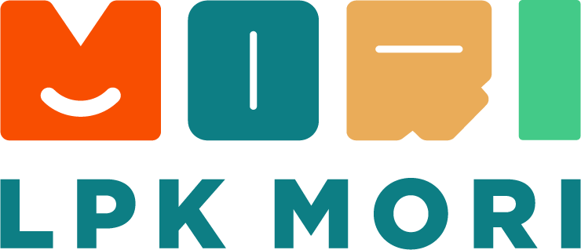

# LPK SO Mori Centre — Platform Manajemen Akademik

<div align="center">



**Platform manajemen akademik bilingual (🇮🇩 Indonesia · 🇯🇵 Jepang) bergaya modern elegan untuk Lembaga Pelatihan Kerja SO Mori Centre**

[](https://go.dev)
[](https://nextjs.org)
[](https://www.postgresql.org)
[](https://docs.docker.com/compose)

</div>

---

## 📑 Daftar Isi

- [Tentang Proyek](#-tentang-proyek)
- [Pembaruan Terkini (Redesign)](#-pembaruan-terkini-redesign)
- [Fitur Utama](#-fitur-utama)
- [Arsitektur](#-arsitektur)
- [Cara Menjalankan](#-cara-menjalankan)
- [Akun Default](#-akun-default)
- [API Reference](#-api-reference)
- [Skema Database](#-skema-database)
- [Teknologi Utama](#-teknologi-utama)

---

## 📖 Tentang Proyek

LPK SO Mori Centre adalah platform web akademik yang dibangun khusus untuk mengelola kegiatan belajar mengajar di lembaga pelatihan kerja. Platform ini mendukung tiga peran pengguna (Super Admin, Guru, Siswa) dan dirancang khusus dengan dukungan bilingual interaktif (Indonesia dan Jepang).

---

## ✨ Pembaruan Terkini (Redesign & Fitur Baru)

Proyek ini baru saja menyelesaikan perombakan besar (Redesign Total) pada antarmuka dan penambahan fungsionalitas:
1. **Desain Elegan Premium**: Mengadopsi palet warna hangat (Warm Canvas, Deep Navy, Teal Accent, Gold) dengan kombinasi tipografi *Inter* (modern sans-serif) dan *Merriweather* (classic serif) agar nyaman di mata (eye-friendly).
2. **Pengumuman Kaya Teks (Rich Text) & Bilingual**: 
   - Dilengkapi *Rich Text Editor* (menggunakan `react-quill-new`) di mana pembuat dapat menebalkan teks, membuat daftar, judul, dll.
   - Pilihan penyematan (Pin to Top) oleh Admin.
   - Fitur terjemahan. Admin/Guru dapat menulis pengumuman utama dalam Bahasa Indonesia, dan menambahkan translasi opsional Bahasa Jepang (日本語). Pembaca cukup mengklik tombol switch 🇮🇩↔🇯🇵 untuk mengubah bahasa tampilan pengumuman tersebut secara instan.
3. **Penyempurnaan Halaman Dashboard**: Tampilan kartu ringkasan (Stat Cards) lebih modern, filter tab yang bersih, notifikasi bell ikonik, dan manajemen modal (popup) yang mulus.

---

## 🚀 Fitur Utama

### � Super Admin
- **Manajemen Akun:** CRUD pengguna (guru & siswa), reset kata sandi, hingga ganti foto.
- **Tahun Ajaran & Kelas:** Menetapkan tahun ajaran aktif, membuat kelas, mengelola nama kelas, dan menetapkan siswa ke dalam kelas (enrollment).
- **Pengumuman Global:** Membuat pengumuman kaya teks, mengedit konten dwibahasa (ID/JA), dan fitur semat (pin) di atas dashboard.
- **Pemantauan Penuh:** Melihat semua modul, laporan kelas, ujian, dan log aktivitas.

### 👨‍� Guru (先生)
- **Manajemen Modul & Pelajaran:** Menambahkan mata pelajaran ke kelas yang diampu.
- **Interaksi Siswa:** Memantau kemajuan belajar siswa dalam kelas.
- **Publikasi Pengumuman:** Menyiarkan kabar atau info ke seluruh warga akademik (dengan opsi terjemahan).

### 👨‍🎓 Siswa (学生)
- **Akses Materi Belajar:** Melihat kelas, materi, dan pengumuman interaktif dalam bahasa pilihan mereka.
- **Evaluasi Diri:** Mengerjakan ujian dan melihat hasil penilaian.

---

## 🏗️ Arsitektur

```text
Browser (Next.js :3000)
        │
        ▼
REST API (Go / Gin :8080)
        │
        ▼
PostgreSQL (:5432)
```

Semua service berjalan di dalam Docker network `lpkmori_net` yang terisolasi.

### Struktur Direktori Terdapat:
- `backend/` : Go REST API (menggunakan framework Gin) dan PostgreSQL Migrations.
- `frontend/` : Next.js 16 (App Router) dengan Tailwind CSS, sistem komponen dinamis, dan sistem role middleware.

---

## � Cara Menjalankan

### Prasyarat
- [Docker Desktop](https://www.docker.com/products/docker-desktop) 24+
- (Opsional) Go 1.24+ & Node.js 20+ jika ingin run manual.

### 1. Menggunakan Docker (Rekomendasi)

*Catatan: Pastikan port `3000` (Frontend), `8080` (Backend), dan `5432` (PostgreSQL) tidak digunakan oleh aplikasi lokal Anda (termasuk NPM dev server lokal).*

```bash
# Build dan jalankan
docker compose up --build -d

# Cek log aplikasi
docker compose logs -f
```

Buka **http://localhost:3000** di web browser.

### 2. Development Lokal (Tanpa Docker)

**Backend (Go):**
```bash
cd backend
go mod download
# Pastikan sudah setting environment (DB_HOST, DLL)
go run ./cmd/api
```

**Frontend (Next.js):**
```bash
cd frontend
npm install
npm run dev
# Dashboard berjalan di http://localhost:3000
```

---

## 🔑 Akun Default

Akun super admin dibuat otomatis saat pertama kali server dinyalakan:

- **Email:** `admin@lpkmori.com`
- **Password:** `password123`
- **Role:** Super Admin

*(Jangan lupa mengganti ini jika digunakan untuk tahap production!)*

---

## 📡 API Reference

Base URL (Development): `http://localhost:8080/api/v1`

| Domain | Contoh Endpoint | Keterangan |
|--------|-----------------|------------|
| Auth | `POST /auth/login` | JWT Otentikasi dan sesi lokal |
| Users | `GET /users` | Manajemen semua jenis Role |
| Academic | `GET /academic-years/active` | Mendapatkan data tahun aktif dan kelas |
| Classes | `POST /classes/:id/enrollments`| Menambahkan relasi Siswa ke Kelas |
| Announces | `POST /announcements` | Menyimpan Rich Text pengumuman & info |

---

## 🗄️ Skema Database

Tabel inti yang dimigrasikan otomatis oleh backend:

- `users`: Identitas dasar, email, password hashing, role.
- `academic_years` & `classes`: Sistem penjadwalan.
- `class_enrollments`: Junction / Pivot table (Many-to-Many).
- `courses` & `course_activities`: Kurikulum, bank soal, kuis.
- `student_answers`: Evaluasi dan pengerjaan ujian.
- `announcements`: Tabel pengumuman dengan kolom terjemahan (`title_ja`, `content_ja`) dan indikator pin (`is_pinned`).

---

## 🛠️ Teknologi Utama

| Layer | Stack Utama |
|-------|-------|
| 🎨 **Frontend** | React, Next.js 16 (App Router), Tailwind CSS (Design Tokens Custom), React-Quill-New, Lucide Icons |
| ⚙️ **Backend** | Go 1.24, Gin Web Framework, GORM ORM, Golang-JWT |
| 🗄️ **Database**| PostgreSQL 16 |
| � **DevOps** | Docker Compose |

---

<div align="center">
  <p>Dibuat dengan ❤️ untuk LPK SO Mori Centre</p>
  <p><em>「学ぶことは一生の宝である」— Belajar adalah harta seumur hidup</em></p>
</div>
