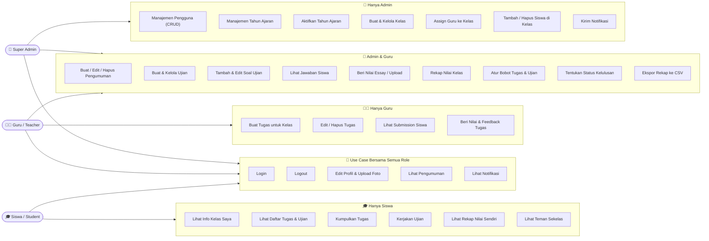
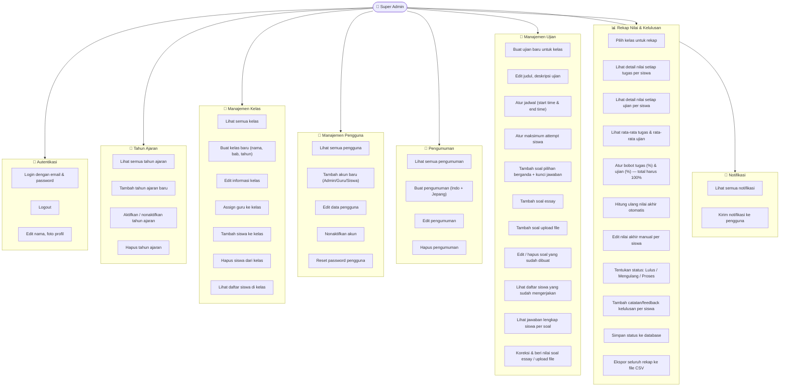
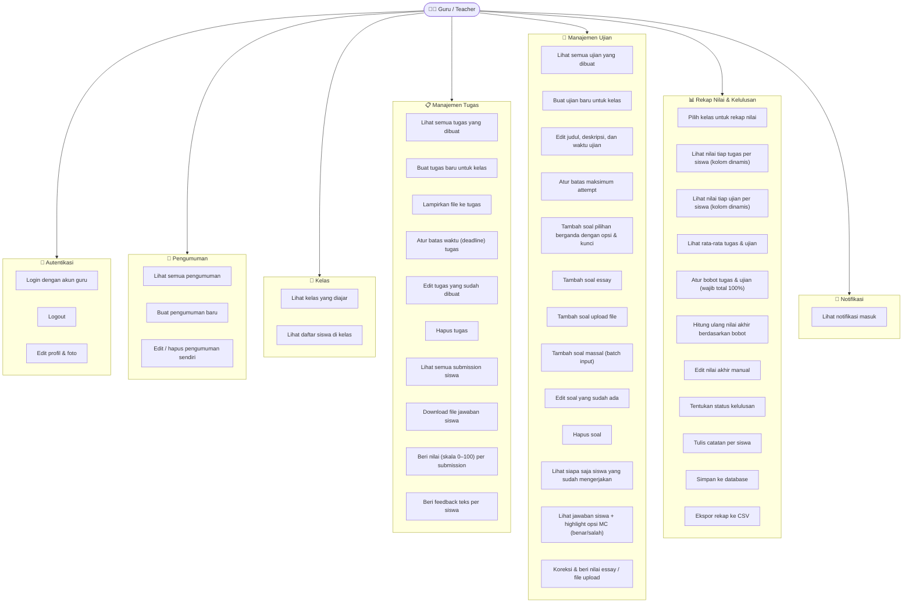
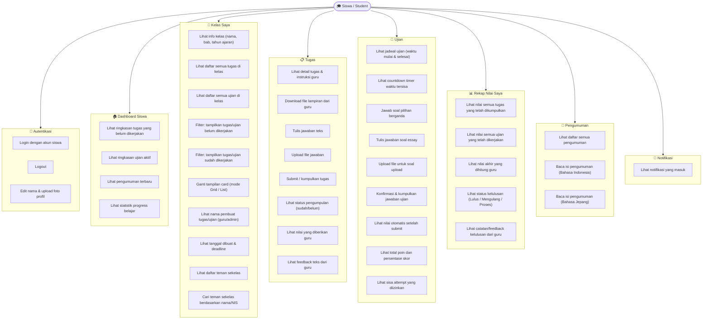

# 📐 Use Case Diagram — LPK SO Mori Centre

> **Sistem Manajemen Pembelajaran (LMS)** dengan 3 aktor utama:
> **👑 Super Admin**, **👨‍🏫 Guru (Teacher)**, dan **🎓 Siswa (Student)**

---

## 1. Diagram Keseluruhan (Overview)

---

## 2. Use Case Detail — 👑 Super Admin

---

## 3. Use Case Detail — 👨‍🏫 Guru / Teacher

---

## 4. Use Case Detail — 🎓 Siswa / Student

---

## 5. Tabel Hak Akses Lengkap

| Fitur / Use Case | 👑 Super Admin | 👨‍🏫 Guru | 🎓 Siswa |
|---|:---:|:---:|:---:|
| **AUTENTIKASI** | | | |
| Login / Logout | ✅ | ✅ | ✅ |
| Edit Profil & Foto | ✅ | ✅ | ✅ |
| **PENGGUNA** | | | |
| Lihat Semua Pengguna | ✅ | ❌ | ❌ |
| Tambah / Edit / Hapus Pengguna | ✅ | ❌ | ❌ |
| Nonaktifkan / Reset Password | ✅ | ❌ | ❌ |
| **TAHUN AJARAN** | | | |
| Buat & Kelola Tahun Ajaran | ✅ | ❌ | ❌ |
| Aktifkan Tahun Ajaran | ✅ | ❌ | ❌ |
| **KELAS** | | | |
| Buat & Edit Kelas | ✅ | ❌ | ❌ |
| Assign Guru ke Kelas | ✅ | ❌ | ❌ |
| Tambah / Hapus Siswa di Kelas | ✅ | ❌ | ❌ |
| Lihat Siswa di Kelas | ✅ | ✅ | ✅ (sekelas) |
| **PENGUMUMAN** | | | |
| Lihat Pengumuman | ✅ | ✅ | ✅ |
| Buat Pengumuman | ✅ | ✅ | ❌ |
| Edit / Hapus Pengumuman | ✅ | ✅ (milik sendiri) | ❌ |
| **TUGAS (ASSIGNMENT)** | | | |
| Buat Tugas | ❌ | ✅ | ❌ |
| Edit / Hapus Tugas | ❌ | ✅ | ❌ |
| Lihat Submission Siswa | ❌ | ✅ | ❌ |
| Beri Nilai & Feedback Tugas | ❌ | ✅ | ❌ |
| Kumpulkan Tugas | ❌ | ❌ | ✅ |
| Lihat Nilai Tugas Sendiri | ❌ | ❌ | ✅ |
| **UJIAN (EXAM)** | | | |
| Buat Ujian | ✅ | ✅ | ❌ |
| Edit Pengaturan Ujian | ✅ | ✅ | ❌ |
| Tambah / Edit / Hapus Soal | ✅ | ✅ | ❌ |
| Lihat Jawaban Siswa | ✅ | ✅ | ❌ |
| Beri Nilai Essay / Upload | ✅ | ✅ | ❌ |
| Kerjakan Ujian | ❌ | ❌ | ✅ |
| Lihat Hasil Ujian Sendiri | ❌ | ❌ | ✅ |
| **REKAP NILAI** | | | |
| Rekap Nilai Seluruh Kelas | ✅ | ✅ | ❌ |
| Lihat Detail Tiap Tugas & Ujian | ✅ | ✅ | ❌ |
| Atur Bobot Tugas & Ujian | ✅ | ✅ | ❌ |
| Hitung Ulang Nilai Akhir | ✅ | ✅ | ❌ |
| Tentukan Status Kelulusan | ✅ | ✅ | ❌ |
| Ekspor Rekap ke CSV | ✅ | ✅ | ❌ |
| Lihat Rekap Nilai Sendiri | ❌ | ❌ | ✅ |
| Lihat Status Kelulusan Sendiri | ❌ | ❌ | ✅ |
| **NOTIFIKASI** | | | |
| Lihat Notifikasi | ✅ | ✅ | ✅ |
| Kirim Notifikasi | ✅ | ❌ | ❌ |
| **KELAS SAYA (SISWA)** | | | |
| Lihat Info Kelas | ❌ | ❌ | ✅ |
| Lihat Daftar Tugas & Ujian | ❌ | ❌ | ✅ |
| Ganti Mode Tampilan Grid/List | ❌ | ❌ | ✅ |
| Lihat Teman Sekelas | ❌ | ❌ | ✅ |

> **Legend:** ✅ Akses Penuh &nbsp;·&nbsp; ❌ Tidak Ada Akses

---

*Dokumen dihasilkan otomatis — LPK SO Mori Centre LMS · 2026*
